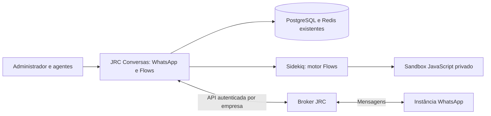

# JRC Conversas com Flows e Broker — candidato de 17/09/2026

> Para o escopo ampliado de 18/09 — Flows também no Broker, Agent Bot e prioridade
> de execução por caixa — leia [o complemento atual](DEPLOY-BROKER-OMNICHANNEL.md).
> As restrições deste texto ao editor exclusivo no JRC são históricas.

Esta versão concentra a criação e execução dos fluxos no **JRC Conversas**. O Broker gerencia organizações, instâncias e transporte de mensagens. O cliente trabalha no JRC; não precisa de n8n ou Typebot para executar os nós implementados no motor JRC.

O portal para Chatwoot de terceiros permanece beta, desabilitado por padrão. O experimento de canvas no Broker não integra esta entrega. Este guia substitui, para esta versão, as propostas de servidor Flows independente em `deploy/flows/` e `docs/JRC_FLOWS_CHATWOOT_EXTERNO.md`.

## Arquitetura e acesso

- Administrador: conecta a organização do Broker, provisiona a caixa, configura credenciais, cria/importa fluxos, testa, ativa e pausa.
- Agente: vê resumos e execuções das caixas das quais é membro. Não recebe definições nem credenciais de fluxos pela API. Reconexão/QR depende também da delegação de acesso configurada no Broker/JRC.
- Superadministrador: habilita `jrc_broker` e `jrc_flows` por conta. As variáveis globais também precisam estar ativas.
- Cada fluxo seleciona caixas **da própria conta**. O canal precisa funcionar no JRC antes de vincular o fluxo.

## O que está pronto e os limites

O motor nativo possui mensagens, captura de resposta, condições, esperas persistidas, variáveis, etiquetas, atribuição, status, HTTP e ações internas. O motor de workflows aceita um subconjunto dos nós e expressões n8n implementados pelo JRC, incluindo JavaScript isolado, Redis interno, OpenAI e subworkflows locais. Importação não significa compatibilidade integral com n8n.

O JSON JADE de 62 nós ainda depende das credenciais e dos subworkflows BTV/KSYS que não foram fornecidos. Ele não está homologado de ponta a ponta. JSON Typebot, PostgreSQL externo e URA/ramais não passam a funcionar por importação; voz não é habilitada nesta versão. WhatsApp, Instagram, Facebook e e-mail dependem dos respectivos canais já configurados e de testes de entrega próprios.

Credenciais protegidas do fluxo são criptografadas com a chave da instalação. A exportação não inclui esses campos protegidos; código e cabeçalhos escritos diretamente no JSON podem conter segredos. Use os campos de credenciais, não segredos literais nos nós.

## Preparação dos repositórios e imagens

As branches `codex/jrc-flows-broker-release-20260917` e `codex/broker-jrc-release-20260917` são candidatas separadas; não substituem automaticamente o código em `main`. Revise os diffs e os resultados de `docs/VALIDACAO-FLOWS-BROKER.md` e integre via revisão nos dois repositórios. O Broker concilia os commits locais de integração com os ajustes de Compose que já estavam em `origin/main`.

No GitHub Actions do JRC, execute **Build JRC Conversas, Flows e Broker**. `publish=false` apenas constrói; `publish=true` publica três imagens com `sha-<SHA completo>`: aplicação, `-nico-runtime` e `-flows-sandbox`. O fluxo antigo Lab3 é manual e não deve ser usado para esta entrega. No Broker, use **Build reviewed SaaS images**, com a mesma distinção entre build e publicação: `ghcr.io/claudiohideki/brokerjrcia-api:<SHA>` e `ghcr.io/claudiohideki/brokerjrcia-web:<SHA>`.

Use tags imutáveis ou digests. Rails e Sidekiq devem executar a mesma revisão. O worker do Broker usa a imagem API da mesma revisão do web. Publicar imagens não faz deploy automaticamente.

Se o Nico já está habilitado, atualize também o serviço existente para `ghcr.io/claudiohideki/jrc-conversas-nico-v12-2-7-comercial-integrado-nico-runtime:sha-<SHA completo>`, antes de Rails/Sidekiq. Preserve o token de serviço, armazenamento e configuração do provedor; confira `/health` pela rede interna. O overlay Flows não cria nem substitui esse serviço. O runtime Nico atual em modo `provider` permite exatamente uma conta por implantação; não o compartilhe entre empresas alterando apenas a lista de contas. Esse limite é independente das credenciais OpenAI configuradas nos workflows Flows. Consulte `services/nico-runtime/README.md`.

O Dockerfile limita `GRPC_RUBY_BUILD_PROCS` a 2 no estágio de compilação para reduzir o pico de memória dos builders compartilhados. O primeiro build ainda compila dependências nativas e pode ser demorado. Esse parâmetro é suportado pelo [build oficial do gRPC 1.72](https://github.com/grpc/grpc/blob/v1.72.0/src/ruby/ext/grpc/extconf.rb); não altera a concorrência da aplicação em execução.

## Atualização no Dokploy

1. Salve o Compose atualmente implantado, as referências de imagens e um backup verificável do PostgreSQL e do armazenamento. Preserve as chaves, volumes, nomes de projeto, banco e redes existentes. Este pacote não contém o Compose real do servidor nem seus segredos.
2. No projeto JRC existente, aplique o complemento `deploy/jrc/compose.flows-broker.yml` ao Compose real. Adapte os nomes `rails`/`sidekiq` se forem diferentes. Confira no Compose final que os serviços continuam nas redes do banco, Redis e proxy, com seus volumes e variáveis anteriores. **Não crie um segundo projeto com um banco vazio e não substitua a stack pelo exemplo genérico do repositório.**
3. Configure `JRC_APP_IMAGE` e `JRC_FLOWS_SANDBOX_IMAGE` para a revisão publicada. Acrescente as variáveis de `deploy/jrc/modules.env.example`. Gere `JRC_BROKER_CREDENTIAL_KEY` como 32 bytes aleatórios em Base64 e `JRC_FLOWS_SANDBOX_TOKEN` como segredo aleatório com pelo menos 32 caracteres. Armazene somente no ambiente/gerenciador de segredos. Preserve `SECRET_KEY_BASE` e a nova chave entre atualizações para manter a leitura das credenciais salvas.
4. `JRC_BROKER_ALLOWED_ORIGINS` deve conter a origem HTTPS exata do Broker (sem barra final, caminho ou porta explícita). `FRONTEND_URL` deve ser a origem HTTPS pública exata do JRC. O backend exige correspondência com o destino registrado no Broker. O sandbox fica sem domínio público e sem portas publicadas, na rede interna compartilhada apenas com Rails/Sidekiq.
5. Em janela de manutenção, suspenda os workers antigos e execute `bundle exec rails db:chatwoot_prepare` com a **nova imagem** e o mesmo banco/ambiente do JRC. Isso aplica as migrações de Flows e da integração Broker. Suba Rails, Sidekiq e sandbox. Não use `db:schema:load` em produção.
6. No projeto Broker existente, atualize o Compose consolidado de `infra/dokploy/compose.yaml` e mantenha os volumes/segredos/dominios do servidor. Defina `JRC_API_IMAGE` e `JRC_WEB_IMAGE`. Execute o serviço de migração conforme `docs/operations/dokploy-saas.md` do Broker antes de subir API/worker/web. A release inclui migrações 0018–0023 além das anteriores. As credenciais da administração da plataforma pertencem apenas à API, não ao worker.
7. No Broker, habilite `CHATWOOT_CONTROL_ENABLED=true` e `CHATWOOT_EXTERNAL_DESTINATIONS_ENABLED=true` para configurar destinos por organização. Apesar do nome da segunda variável, ela também habilita o destino particular de cada cliente JRC. Mantenha `CHATWOOT_EMBED_ENABLED=false`. Restrinja os destinos aprovados às instalações JRC operadas nesta versão.
8. Habilite `JRC_FLOWS_ENABLED=true` e `JRC_BROKER_ENABLED=true` no JRC após a migração. No Super Admin habilite as funcionalidades **JRC Flows** e **JRC Broker** apenas nas contas autorizadas. Alternativa no console Rails: `Account.find(ID_DA_CONTA).enable_features!('jrc_flows', 'jrc_broker')`. Mantenha `JRC_FLOWS_EXTERNAL_BETA=false`.

No Dokploy, configure os domínios no serviço público correto (JRC Rails porta 3000; Broker web porta 8080). Confira o **Preview Compose**, que inclui as regras de proxy acrescentadas pelo Dokploy. Não publique PostgreSQL, Redis ou sandbox. Referência: [Dokploy — Domains](https://docs.dokploy.com/docs/core/docker-compose/domains).

## Vincular uma empresa e sua caixa

1. No Broker, crie/selecione a organização da empresa, registre o destino JRC com origem, ID da conta e token de uma conta autorizada; valide e aprove o destino. Os IDs precisam corresponder à conta que será configurada no JRC.
2. Em Chaves de API do Broker, emita uma chave com os escopos de controle necessários para essa organização. No JRC, como administrador, abra **WhatsApp/Conexões** ou **Configurações → Caixas de entrada → JRC Broker** e informe origem, ID da organização e chave de controle. O backend valida a associação e armazena a chave criptografada.
3. Selecione/crie a instância e vincule a caixa. Faça o pareamento QR e confira o estado da conexão. Adicione os agentes à caixa e delegue a permissão de reconexão somente quando necessário.
4. Primeiro valide uma conversa e resposta manual pelo canal. Depois abra **Flows**, crie um fluxo simples ou importe JSON, selecione a caixa em **Configurações**, valide e teste no Playground. Salve e ative somente depois.
5. Use um único responsável pela automação da conversa. Desative o Typebot ou outro bot no canal do Broker antes de ativar Flows na mesma caixa; esta versão não migra automaticamente sessões Typebot nem arbitra bots externos concorrentes.

## Roteiro de aceite antes de liberar clientes

Use inicialmente uma conta e caixa de homologação. Crie `Início → Enviar mensagem (Qual seu nome?) → Capturar resposta (nome) → Enviar mensagem (Olá, {{nome}}) → Encerrar`. Confira validação, ativação, resposta, variável e execução concluída. Teste pausa com uma execução aguardando, tomada de atendimento humano e reconexão autorizada do agente. O Playground não comprova entrega no WhatsApp.

Entre como agente: apenas as caixas atribuídas devem aparecer, sem edição de fluxos nem acesso a tokens. Entre em outra conta: fluxos, instâncias e execuções da primeira não devem aparecer. Remova a funcionalidade da conta e confirme o bloqueio de novas execuções e entregas pendentes.

Importe o JADE em rascunho separadamente. Importe/associe cada subworkflow e configure OpenAI/HTTP antes de testar cada ramo. Redis de memória usa o Redis interno isolado por conta/fluxo; não reutiliza automaticamente as credenciais Redis do n8n. Consulte erros e rastros na aba **Execuções** e nos logs do Sidekiq/Broker, sem publicar dados de clientes.

## Retorno à versão anterior

Desabilite os módulos por conta/globalmente e pause os fluxos, suspenda workers, restaure as referências das imagens anteriores e reinicie a stack existente. Preserve bancos, volumes e chaves. As tabelas adicionadas podem permanecer para diagnóstico; não faça rollback destrutivo de migrações como substituto de rollback de imagem. Uma restauração de banco exige o backup e reconciliação das mensagens ocorridas depois dele.

O servidor e o registro GHCR não foram alterados por esta preparação local. A liberação final depende do build/publicação da revisão revisada e do aceite no ambiente de homologação do servidor.
