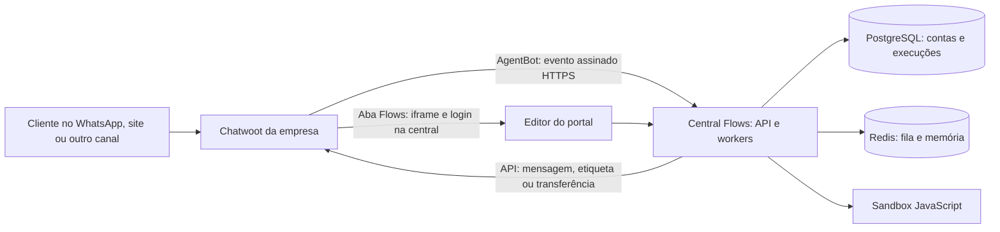

# Flows dentro de outro Chatwoot

> Histórico beta. Na release de 17/09, o foco é o módulo nativo do JRC e o portal externo fica desligado (`JRC_FLOWS_EXTERNAL_BETA=false`). Siga [o guia atual](DEPLOY-FLOWS-BROKER.md). A instalação externa local recebeu customizações posteriormente; ela não comprova compatibilidade com qualquer Chatwoot sem modificações.

Implementação e homologação local: 16/09/2026. Destino testado: imagem oficial Chatwoot 4.14.0.

## O que foi construído

O editor abre na aba **Flows**, ao lado de **Mensagens**, dentro de uma conversa do Chatwoot da empresa. É um Dashboard App oficial com iframe. O motor executa na central JRC e recebe eventos assinados de um AgentBot vinculado às caixas selecionadas. Não usa n8n nem o webhook de um workflow n8n.

O pacote inclui cadastro de conexões, teste de API, seleção de caixas, instalação do bot/aba, editor, importação/exportação JSON, validação, execução remota, histórico e interrupção humana. A instalação recusa substituir um bot de outro fornecedor já conectado à caixa.

**Limite de apresentação:** Dashboard Apps adiciona uma aba na conversa. Não cria um item global na barra lateral do Chatwoot. Para o mesmo menu lateral do JRC seria necessário manter um patch do frontend do Chatwoot cliente e recompilá-lo a cada atualização. A integração entregue usa a extensão oficial e evita essa dependência.

**Limite de empacotamento:** o portal é uma entrada de frontend própria, mas a central ainda utiliza o backend Rails atualizado do JRC, seus usuários/contas, Sidekiq e bibliotecas. O cliente externo não recebe o JRC. Este pacote não é uma distribuição mínima contendo apenas o motor; extrair fisicamente esse serviço é uma etapa posterior.



## Testar neste computador

1. JRC/central: `http://localhost:3116`. Gerenciador: `http://localhost:3116/flows/portal`.
2. Chatwoot independente: `http://localhost:3117`. Conta **Empresa Externa | Homologação**, caixa **Atendimento da empresa**.
3. Abra a conversa nº 2 e a aba **Flows**. A conversa mostra duas respostas do bot e a interrupção após a mensagem humana.
4. O login do Chatwoot de teste é `admin@empresa-hml.local`. A senha gerada está somente no arquivo local `local/chatwoot-external.env`, chave `HML_LOGIN_PASSWORD`.
5. No iframe, entre com seu acesso à central JRC (`admin@jrc.local` no ambiente atual). A senha permanece em `local/flows.env`, chave `FLOWS_LOCAL_PASSWORD`.
6. Os flows de validação ficaram **pausados**. Para um novo teste, ative apenas um flow da conexão e crie uma conversa nova na caixa com status **Pendente**, sem atendente atribuído. O fluxo de demonstração retorna “Olá! Recebi sua mensagem: …”.

São instalações com PostgreSQL, Redis e volumes distintos. Não há leitura direta do banco externo pela central. Somente os serviços web/worker participam de uma ponte Docker de homologação. O Chatwoot oficial recebeu uma exceção de rede estritamente limitada ao callback `http://flows-central:3000/jrc_flows/events/…`, pois seu SafeFetch bloqueia redes privadas. Essa exceção é apenas de homologação; não faz parte do deploy de produção. Em produção use HTTPS público e o Chatwoot original sem essa exceção.

Para ligar novamente os ambientes existentes, na raiz do projeto:

```powershell
docker compose -f local/chatwoot-external.compose.yml up -d
docker compose -f local/flows.compose.yml up -d
```

Os arquivos `local/` contêm senhas e fixtures deste computador e **não são distribuídos** no ZIP.

## Hospedagem recomendada

Uma central em `https://flows.suaempresa.com.br` atende várias empresas. Para cada empresa, crie uma **conta própria na central**, convide apenas seus administradores e cadastre uma conexão com o domínio, account ID e token daquela instalação Chatwoot. IDs de conta/conversa repetidos em instalações diferentes não se confundem: sessões e eventos usam a identidade da conexão.

Cada Chatwoot cliente continua hospedado onde está. WhatsApp, Instagram, Facebook, e-mail e outros provedores continuam configurados nele. A central trabalha com mensagens normalizadas pelo Chatwoot. A homologação realizada usa uma caixa API; entrega e restrições específicas de cada provedor devem ser verificadas com a caixa real, incluindo janela de atendimento e modelos do WhatsApp.

Outra opção é instalar uma central dedicada por empresa, com domínio, banco, Redis, sandbox, segredo de criptografia e volumes próprios. Use essa opção quando for necessário isolamento físico ou operação dentro da infraestrutura do cliente. Não conecte o módulo diretamente ao banco do Chatwoot dele.

O servidor central precisa de Docker/Compose, domínio HTTPS e saída HTTPS para as APIs dos Chatwoots e provedores usados pelos nós. O Chatwoot cliente precisa alcançar o callback HTTPS da central. PostgreSQL, Redis e sandbox não precisam de portas públicas. Dimensione a partir de conversas simultâneas, tempo de IA e fila; não foi realizado ensaio de carga para afirmar uma capacidade em clientes.

## Deploy da central em Linux

O diretório `deploy/flows` contém um Compose de produção e exemplo de Nginx. Esse Compose cria **uma nova central**, com volumes próprios; não é um comando para migrar automaticamente os dados do JRC existente.

Na raiz do código atualizado:

```bash
cp deploy/flows/.env.example deploy/flows/.env
chmod 600 deploy/flows/.env
```

Edite `.env`: configure `FRONTEND_URL`, SMTP e segredos independentes. Gere `SECRET_KEY_BASE` com `openssl rand -hex 64`; gere senha PostgreSQL, senha Redis e token sandbox com `openssl rand -hex 32`, uma chamada para cada segredo. Guarde os valores em um gerenciador de segredos. O token sandbox deve ter pelo menos 32 caracteres. Não configure `JRC_FLOWS_WEBHOOK_BASE_URL` nem origens locais em produção.

```bash
cd deploy/flows
docker compose build web flows-sandbox
docker compose run --rm web bundle exec rails db:chatwoot_prepare
docker compose up -d
docker compose ps
```

Configure DNS/certificado e Nginx conforme `nginx.conf.example` ou seu proxy atual. Ele deve apontar para `127.0.0.1:3216`, preservar `Host`, informar `X-Forwarded-Proto: https`, permitir WebSocket e não substituir a política CSP da aplicação. O iframe é permitido somente na origem Chatwoot registrada na conexão. Um proxy que acrescente `X-Frame-Options: DENY`/`SAMEORIGIN` a todas as respostas bloqueará o portal.

Faça o onboarding inicial da central pelo domínio. Depois, pelo superadmin da central, crie uma conta por empresa e convide o administrador correspondente. SMTP deve estar funcional para convites e recuperação de acesso. O login do iframe é **o da central**: não há SSO automático com o Chatwoot externo. A sessão fica na memória da página, sem token na URL, localStorage ou mensagens postMessage; reabrir a aba pode exigir novo login.

Para atualizar uma central já em uso: faça backup primeiro, produza uma imagem com tag nova, aplique `bundle exec rails db:migrate` com a imagem nova, reinicie web/worker e valide uma caixa de homologação antes de liberar clientes. Esta entrega acrescenta a migração `20260916160000_create_jrc_flow_connections.rb`. Preserve `SECRET_KEY_BASE`: trocá-la sem migração dos dados torna os segredos/workflows antigos indecifráveis. Faça backup conjunto de PostgreSQL, Redis, storage e configuração segura. O rollback de imagem deve considerar compatibilidade com o schema; não execute rollback destrutivo de banco automaticamente.

Se reaproveitar seu servidor JRC, basta implantar o código atualizado, aplicar as migrações, compilar assets e configurar o sandbox em web/worker. A central estará no mesmo domínio do JRC em `/flows/portal`. Não suba o Compose de central nova apontando para volumes desconhecidos.

O Compose foi validado estruturalmente; o deploy Linux público, TLS, SMTP e restauração de backup não foram executados neste computador Windows.

## Conectar a empresa cliente

1. Solicite ao administrador da empresa a URL HTTPS, o account ID e um token de usuário administrador de integração. Use um usuário dedicado com acesso somente à conta necessária, quando possível. Cadastre o token no formulário seguro do portal, nunca no JSON do flow.
2. Entre em `/flows/portal` com o administrador da conta dessa empresa na central. Escolha **Nova conexão** e informe os dados.
3. Clique **Testar conexão e listar caixas**. Selecione somente as caixas autorizadas. O teste consulta caixas, equipes, agentes e etiquetas pela API do Chatwoot.
4. Clique **Instalar módulo nas caixas selecionadas**. Serão criados um AgentBot, o vínculo nas caixas e um Dashboard App chamado **Flows**. O segredo de assinatura e o token do bot são armazenados criptografados na central. Repetir a instalação reutiliza os IDs criados.
5. Abra uma conversa no Chatwoot cliente. Atualize a página para carregar a nova aba e clique **Flows**. Faça login na conta da empresa na central.
6. Importe/crie o flow, configure a caixa em **Configurações**, associe os subworkflows importados, cadastre chaves de IA/API, clique **Validar**, **Salvar** e **Ativar**. O backend recusa ativação quando existem dependências ou nós incompatíveis.
7. Envie uma mensagem de teste em conversa nova, pendente e sem humano. Confira a resposta em **Mensagens** e a execução na aba **Execuções**.
8. Faça o teste de transferência e atendimento humano antes de liberar a caixa. Para suspender, pause o flow ou use **Desconectar bot**. A desconexão desativa a conexão, pausa sessões e remove apenas os vínculos que ainda pertencem ao bot dela; mantém a aba e histórico.

Use Chatwoot compatível com AgentBot, Dashboard Apps e callbacks assinados. A versão homologada foi **4.14.0**. Versões antigas/forks podem divergir; ausência de segredo/token do bot impede a instalação. Não se anuncia compatibilidade universal com qualquer fork.

## Credenciais, execução e limites atuais

- O token administrativo atende leitura de conversas/catálogos e etiquetas, pois o Chatwoot oficial limita as permissões do token de bot. Respostas, atribuições e status usam o token do bot, preservando sua identificação como automação.
- As credenciais OpenAI/HTTP da conexão são herdadas pelos flows; a configuração de um flow pode sobrescrevê-las. Redis de memória é o da central, isolado pelo contexto do flow/conta. Não há cadastro genérico de um Redis/PostgreSQL externo por nó nesta versão.
- Segredos cadastrados nos campos próprios não são exportados. Valores escritos diretamente nos parâmetros/código JSON continuam no arquivo exportado; remova-os antes de compartilhar.
- Nós nativos remotos: mensagem, captura, condição, caminhos, espera, variável, nota privada, etiquetas, atribuição, status e encerramento. CRM/Nico, mídia e edição de contato específicos do JRC não têm adaptador remoto nesta entrega e bloqueiam ativação.
- Workflows importados usam o subconjunto já implementado pelo motor JRC: entrada, JavaScript síncrono em sandbox, IF/Switch, Redis get/set/delete, HTTP, Set, resposta, subworkflow e IA compatível. Não se trata do runtime completo do n8n. Postgres, módulos JavaScript, ferramentas/langchain extras e nós não suportados exigem implementação própria.
- Os subworkflows precisam ser importados na **mesma conexão**, selecionados e testados. O Jade enviado ainda depende dos JSONs BTV/KSYS e credenciais reais; não foi liberado como pronto para atendimento.
- Uma única sessão por conversa/conexão. Um workflow avançado pode atender várias mensagens nessa sessão. Sessões concluídas, pausadas ou com falha não reiniciam automaticamente ao reabrir a mesma conversa; use conversa nova nos testes. Mensagens antigas são ignoradas pelo ID. Não foi implementada reconstrução de ordem de eventos atrasados fora de sequência.
- Eventos repetidos são deduplicados, assinatura HMAC e timestamp são conferidos, conta/caixa são validadas e sessões são serializadas por conversa. Ações com resultado incerto não são reenviadas automaticamente para evitar respostas duplicadas. Falhas anteriores à criação de sessão ficam registradas nos eventos do backend, sem painel próprio de eventos nesta versão.
- Mensagem humana ou saída do estado pendente interrompe a automação. O motor também relê atribuição/status antes de executar nós/enviar respostas. Ainda existe a janela de concorrência entre essa leitura e uma chamada HTTP, inerente a APIs sem operação atômica de posse/envio.
- Há limite de passos/turnos e recuperação de esperas persistidas. Redis/filas e PostgreSQL devem permanecer disponíveis. Monitore sessões em falha, duração, filas, disponibilidade dos callbacks e consumo das APIs.
- Payloads de eventos são criptografados e eliminados após 7 dias quando concluídos/falhos. Variáveis e rastros de sessões permanecem no banco da central; podem conter dados da conversa. Defina a política operacional de retenção e backup para cada empresa antes de produção.

## Evidências da homologação

- Provisionamento real de AgentBot e Dashboard App por API no Chatwoot oficial, com bancos independentes.
- Duas mensagens recebidas e duas respostas do bot na mesma execução, sem n8n.
- Captura de nome, persistência da variável, resposta personalizada, etiqueta e transferência à equipe do Chatwoot externo.
- Espera retomada pelo worker; interrupção após resposta humana.
- Rejeição de assinatura falsa/expirada e conta/caixa incorretas; deduplicação de evento.
- Isolamento por conta nas APIs; endpoints exigem autenticação; URL do iframe não contém segredo.
- Credenciais criptografadas e flows externos separados dos locais do JRC.

Esses testes não substituem homologação com provedores reais, testes de carga, auditoria de infraestrutura ou implantação no servidor de uma empresa cliente.

Referências oficiais: [AgentBots](https://www.chatwoot.com/hc/user-guide/articles/1677497472-how-to-use-agent-bots), [Dashboard Apps](https://www.chatwoot.com/hc/user-guide/articles/1677691702-how-to-use-dashboard-apps), [Webhooks e assinatura](https://www.chatwoot.com/hc/user-guide/articles/1677693021-how-to-use-webhooks), [deploy Docker](https://developers.chatwoot.com/self-hosted/deployment/docker).
