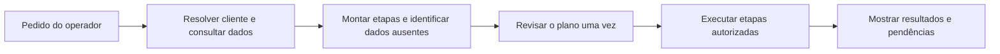

# NICO — auditoria de continuidade e fluidez

09/09/2026. Análise do histórico fornecido pelo operador, do código atual e dos registros locais citados. As consultas ao banco foram executadas em transação somente leitura. Esta auditoria apresenta correções propostas; não implementa o novo fluxo nem altera contatos, leads, produtos, permissões ou compromissos. Evidência: `validation/nico-fluency-audit-20260909.json`.

## Conclusão

O NICO executa ações reais, mas ainda transfere ao operador a coordenação entre elas. O pedido “cadastre e agende” precisa continuar como uma tarefa única até terminar. Hoje a resposta pode prometer várias etapas, enquanto o executor realiza uma escrita e encerra. Isso explica parte das confirmações repetidas, dos dados solicitados novamente e da necessidade de pedir “agora faça o próximo passo”.

A revalidação encontrou falhas de integridade e diagnóstico que têm prioridade sobre ajustes de redação: contato e conversa incompatíveis foram aceitos na criação de lead, uma função inexistente foi apresentada como falta de permissão e um horário sem fuso visível resultou em compromisso três horas antes do esperado em São Paulo.

Os 139 testes anteriores passaram para os cenários então definidos. Eles não cobriam esta sequência natural de pedidos, a combinação conflitante de contato/conversa, o cadastro de produto ausente nem a expectativa de horário local. A aprovação daquela suíte não comprova o fluxo comercial completo. O ZIP gerado antes desta auditoria contém a implementação anterior e não deve ser considerado uma versão com estas correções.

## O que foi confirmado

| Prioridade | Pedido/comportamento | Evidência e causa | Correção necessária |
| --- | --- | --- | --- |
| Alta | Criar contato “teste” e lead para a conversa 13 | Comando 16 recebeu `contact_id=51` e `conversation_id=13`. O lead 14 foi salvo com `contact_id=48`, nome NICO QA Cliente 3. `ToolExecutor#create_lead` prioriza a conversa e ignora o contato informado. | Validar que conversa e contato representam a mesma pessoa antes da prévia e da execução. Havendo conflito, mostrar os dois nomes e solicitar uma escolha. Não alterar o titular da conversa nem mesclar pessoas implicitamente. |
| Alta | Reunião dia 10 às 10h | Atividade 8 vinculada ao lead 15 foi salva em `2026-09-10T10:00:00Z`, equivalente a `07:00 -03:00` em São Paulo. O fuso de relatórios da conta está vazio. | Resolver fuso explicitamente e mostrar data completa e horário local na prévia. Para 10h em São Paulo, o instante correto é 13h UTC. Rever a atividade existente após confirmar o fuso pretendido, sem mudar silenciosamente a configuração global da conta. |
| Alta | Cadastro de produto retornou “Seu perfil não permite” | O usuário local é administrador, com CRM habilitado. O catálogo tem `list_products`, mas não `create_product`. Validar uma ferramenta inexistente gera `Pundit::NotAuthorizedError`. | Implementar a ação pelo endpoint de produtos existente, que exige administrador. Separar função não implementada, permissão negada, canal indisponível e dado ausente. |
| Alta | “Crie contato e agende” executou somente contato | O contrato do modelo permite uma ferramenta; `execute` salva o resultado e encerra. Não há plano com etapas pendentes. No trecho da agenda foram 11 mensagens do operador para concluir contato, lead e reunião. | Persistir objetivo, entidades, data, etapas e aprovações. Executar a sequência autorizada e interromper somente por falta real de informação, falha ou mudança de escopo. |
| Média | `Valor inválido: lead_id` | O modelo Activity exige lead ou negócio. O catálogo não expressa essa dependência de forma verificável; identificador opcional nulo reproduz a mensagem técnica observada. O valor proposto na tentativa original não foi persistido, portanto não é possível afirmar que era exatamente nulo. | Verificar lead/negócio antes de preparar a reunião. Se não houver, propor criação na mesma revisão. Não enviar identificador nulo. Traduzir erro para uma pendência compreensível. |
| Média | Produto de R$ 60 exigiu confirmação em centavos | O JRC já possui `unit_price_cents` e `cost_cents`, campos distintos. O operador disse “custo”. | Converter moeda no sistema. Perguntar se R$ 60 é custo interno ou preço de venda e qual a recorrência, quando esses dados forem necessários. Não tratar custo como preço sem esclarecimento. |
| Média | NICO pediu IDs de conversa | Há consulta de conversas e dados da conversa aberta. O modelo pode resolver nomes; a interface já oferece seleção múltipla. | Oferecer nomes e resumo do interesse, com seleção visível. Usar IDs internamente. Perguntar qual pessoa somente se houver ambiguidade real. |
| Média | “A conversa está ativa” com NICO pausado | As delegações 11, 12 e 13 estavam pausadas por retomada humana. `read_conversation` não informa estado da delegação, responsável atual ou validade. | Distinguir conversa aberta, cliente aguardando, NICO atendendo, NICO pausado e atendimento com humano. Informar estado consultado naquele momento. |
| Média | Data e intenção precisam ser repetidas | A sessão guarda até 80 mensagens, mas só as últimas 16 entram no planejamento. O contexto guarda recursos e último resultado, sem objetivo, campos coletados ou etapas pendentes. | Criar memória estruturada da tarefa. Preservar dados ao mudar de módulo e resolver “esse cliente”, “essa proposta” e “pode continuar” por entidade e tarefa. |
| Média | Confirmação verbal seguida de nova confirmação | Toda escrita prepara uma revisão; uma nova mensagem cancela prévias anteriores e inicia novo planejamento. O prompt pede para evitar confirmação textual, mas isso não é garantido pelo fluxo. | Unificar botão e confirmação por texto/voz. “Sim” autoriza somente a revisão vigente e inequívoca. Uma correção de dados gera nova versão para revisão. |

O pedido de proposta falhou no comando 17 sem ferramenta registrada. A ação `create_proposal` existe e estava disponível ao administrador. Não há evidência suficiente para determinar qual ferramenta o modelo tentou usar naquela falha. O diagnóstico genérico é inadequado. Devem ser registrados o nome proposto e um código de falha seguro, sem gravar credenciais ou resposta bruta do provedor.

Os telefones dos contatos 51 e 52 estão salvos com prefixo internacional e 13 dígitos. Nesse ponto, o dado persistido está normalizado; o problema visível foi a revisão inconsistente e a repetição de perguntas.

## Fluxo proposto

Uma tarefa deve conter objetivo, conta/usuário, cliente selecionado, conversa, contato, lead, negócio, produto, data com fuso, informações faltantes, etapas concluídas e próxima etapa. Os IDs precisam carregar o tipo da entidade: conversa 13, contato 13 e lead 13 são recursos diferentes. Dados de contato já consultados não devem ser substituídos silenciosamente pelo último cadastro feito em outra tarefa.

Cada etapa utiliza o ID real retornado pela anterior. A revisão mostra o que será criado, o que será reutilizado, para qual pessoa e com qual efeito. A execução revalida permissões e vínculos. Em caso de falha parcial, o NICO informa o que já existe e retoma dali, sem recriar o contato nem repetir um envio incerto.

Estados sugeridos: coletando dados, aguardando revisão, executando, parcialmente concluída, concluída, bloqueada e cancelada. “Concluída” se refere ao objetivo inteiro; uma resposta sem ferramenta pode ser apenas coleta de informação. O contador de etapas ajuda o operador a acompanhar “Contato concluído; lead concluído; reunião agendada”.

Para os fluxos frequentes, usar sequências conhecidas no sistema:

- **Contato e lead:** resolver conversa/contato, verificar correspondência, procurar lead existente, revisar as criações necessárias e executá-las.
- **Reunião:** resolver cliente, verificar lead/negócio, propor criação quando necessário, confirmar data com fuso e registrar a atividade. Convite por mensagem é um efeito separado, incluído somente quando solicitado.
- **Proposta:** resolver cliente e negócio, buscar o produto/solução e quantidade, conferir preço e recorrência, preparar proposta e itens, cumprir aprovações do CRM. Criar uma proposta não significa enviá-la.
- **Produto:** validar capacidade e papel antes de coletar campos; distinguir custo e preço, normalizar BRL e recorrência, detectar cadastro existente e apresentar uma única revisão.
- **Atendimento comercial:** apresentar os clientes elegíveis por nome, objetivo, duração e limite de ação; assumir apenas os selecionados; acompanhar estados reais e oferecer retomada direta.

## Exemplo de conversa mais fluida

**Operador:** Agende uma reunião com Thiago Ribeiro dia 10 às 10h. Se não estiver cadastrado, cadastre.

**NICO:** Não encontrei Thiago Ribeiro. Qual é o telefone ou e-mail?

**Operador:** [informa o telefone]

**NICO:** Vou cadastrar Thiago Ribeiro, criar o lead necessário e agendar a reunião para 10/09/2026 às 10h, horário de Brasília. Confira o telefone. [Confirmar plano] [Corrigir]

**Operador:** Pode fazer.

**NICO:** Concluído: contato cadastrado, lead vinculado e reunião marcada para 10/09 às 10h. [Abrir reunião]

Esse diálogo pressupõe que o fuso Brasília já foi escolhido pelo operador e que a criação do lead faz parte da revisão autorizada. Se o contato ou lead já existir, o NICO o reutiliza. Se existirem homônimos, apresenta opções. O resultado final deve usar os dados e IDs efetivamente confirmados pelo backend.

Para o produto, a pergunta útil seria: “Os R$ 60 são custo interno ou preço de venda? A cobrança será mensal ou única?”. A conversão para centavos é interna. Para a conversa 13, a pergunta útil é sobre a identidade conflitante, não sobre preencher novamente um contato que o sistema já possui.

## Cobertura de tudo que foi solicitado

| Área solicitada | Avaliação atual | Evolução para fluidez |
| --- | --- | --- |
| Assistente único e navegação | Sessão persistida e painel adaptável já existem; histórico não equivale a uma tarefa persistida. | Mostrar objetivo em andamento e ações concluídas sem depender da página aberta. |
| Contatos e CRM | Escritas reais comprovadas; conflito de identidade confirmado. | Resolver entidades e garantir correspondência entre conversa, contato, lead e negócio. |
| Agenda | Criação real comprovada; dependência de lead e fuso expuseram falhas. | Verificar pré-requisitos antes, revisar data local e encadear etapas. |
| Produtos e propostas | Produto pode ser consultado, mas não criado por NICO. Proposta tem ação básica, sem fluxo completo de composição. | Integrar administração de produtos e montagem da proposta com itens, cliente e negócio resolvidos. |
| Conversas comerciais simultâneas | Respostas para três clientes fictícios já foram testadas; delegação delimitada e retomada existem. | Status atual confiável, seleção por nomes, regras comerciais públicas aprovadas e testes com conversas intercaladas mais longas. |
| Proatividade | Existem sugestões de novas necessidades e badge. | Exibir sugestão específica, motivo e próximo passo, sem repetir avisos descartados; não assumir atendimento por iniciativa do modelo. |
| E-mail, ligações, Calls e vídeo | Há integrações com módulos existentes. A conta local não possui os canais externos configurados. | Validar capacidade antes de prometer execução; distinguir preparado, iniciado, entregue, atendido e encerrado. Homologar com os canais reais. |
| Campanhas | Há ações de rascunho, revisão, execução e relatório, com dependências do módulo. | Completar fluxo de público, conteúdo, consentimento, aprovação e resultado sem suposições de destinatários. |
| Relatórios e cockpit | Resumo operacional limitado e relatórios de campanha. | Resolver período, equipe e fuso; apresentar escopo e fonte; ampliar filtros onde ainda há somente navegação. |
| Configurações | Disponibilidade e consultas de canais; não existe administração geral por linguagem natural. | Declarar capacidade por operação e papel, com revisão específica para efeitos administrativos. |
| Voz e mascote | Transcrição revisável, leitura opcional e layout adaptável implementados; áudio sintético foi testado. | Texto e voz devem acionar a mesma tarefa e a mesma revisão. Validar microfone real e fala durante uso de telefonia. |
| BEMTEVI/Help Desk | Novas consultas ERP retiradas. | Manter fora do contexto e explicar quando não existe informação interna suficiente. |

## Ordem de implementação e aceite

1. **Integridade e diagnóstico:** bloquear divergência de pessoa, resolver fuso, diferenciar erro de capacidade e de permissão, persistir diagnóstico seguro. Reproduzir os casos deste histórico antes da correção e exigir resultado correto depois.
2. **Continuidade:** adicionar tarefa com etapas, dados persistidos, confirmação única e retomada parcial; expressar pré-requisitos de cada fluxo no código e no contrato de ferramentas.
3. **Cobertura comercial:** criar/atualizar produtos conforme perfil, selecionar produto e negócio, preparar itens e proposta; manter custo, preço, aprovação e envio como conceitos distintos.
4. **Interação:** seleção por nomes, estado real de atendimento, correções em linguagem natural, exemplos de próximos passos e voz usando o mesmo fluxo.
5. **Homologação dos canais:** completar testes externos de envio, chamadas e vídeo com canais e destinos autorizados.

Critérios de aceite a acrescentar à suíte:

- Pedido composto termina sem o operador repetir o próximo passo ou os campos já fornecidos.
- Contato A e conversa do contato B geram uma escolha explícita antes de qualquer escrita relacionada.
- Contato/lead existentes são reutilizados; repetição da mesma aprovação não duplica recursos.
- Data 10/09/2026 às 10h em São Paulo é persistida em 13h UTC e exibida novamente como 10h local.
- Cadastro de produto pelo administrador chega ao endpoint autorizado; agente sem permissão recebe o diagnóstico correto antes de coletar dados desnecessários.
- R$ 60,00 é convertido corretamente; custo interno não substitui preço de venda.
- Reunião sem lead identifica a dependência e apresenta uma revisão, sem expor `lead_id` ao operador.
- Alterar uma informação invalida a revisão anterior; “sim” com duas tarefas possíveis exige desambiguação.
- Mudança de módulo ou conversa não troca a pessoa da tarefa vigente.
- Falha na terceira etapa preserva as duas anteriores e informa a pendência. Falha externa incerta não gera repetição automática.
- Pedido de status informa que o NICO está pausado quando a delegação estiver pausada, mesmo com conversa aberta.
- Conversas comerciais intercaladas não compartilham nomes, dados privados, produtos escolhidos ou etapas de outra pessoa.

A avaliação com IA real deve incluir as frases deste histórico, variações de digitação e respostas curtas como “sim”, “esse cliente” e “pode continuar”. Os testes precisam verificar vínculos, horários, número de perguntas desnecessárias e conclusão do objetivo, além de HTTP e criação de registros. Usar dados sintéticos e não considerar respostas antigas como evidência de uma nova rodada.

## Pontos de código para a correção

- `app/services/jrc_nico/operator_session.rb`: memória da tarefa, continuidade, revisão e erros.
- `app/services/jrc_nico/tool_executor.rb`: coerência de entidades, pré-requisitos, fuso e estado de atendimento.
- `app/services/jrc_nico/tool_catalog.rb` e `module_actions.rb`: capacidades completas, condições, parâmetros e diagnóstico.
- `services/nico-runtime/src/operations.ts`: contrato de planejamento, respostas alinhadas às etapas reais e ferramentas disponíveis.
- `app/javascript/dashboard/components-next/jrcCopilot/JrcCopilotPanel.vue`: plano visível, seleção por nome, uma revisão e resultados por etapa.
- Controllers e serviços CRM existentes de produtos, atividades e propostas: fonte das regras que a automação deve seguir.

Os registros de teste a revisar são contato 51/lead 14/conversa 13 e atividade 8. O contato 52 e o lead 15 estão vinculados corretamente; a atividade 8 está vinculada ao lead 15, mas seu horário precisa da revisão descrita acima.
